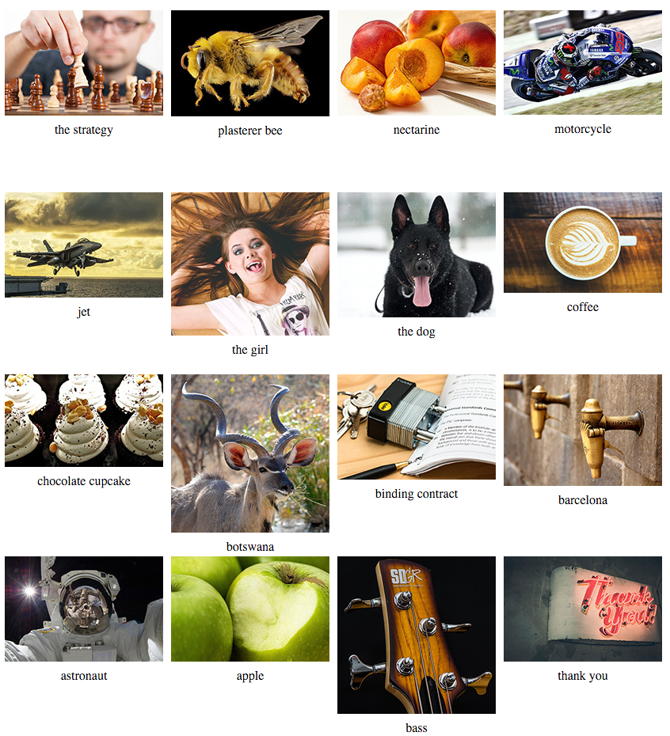

# The Problem

A website needs to display a large set of images and metadata in a grid/block format, however, the information needed to show the images their descriptions is stored in JavaScript Object Notation (JSON). When the page is finished loading, your JavaScript should iterate through the JSON object and properly display each image in 200px x 200px boxes.

#What to Code

Using jQuery, write a JavaScript function(s) which runs when the page is loaded, parses and displays an image using the "image" value for each object and the "name" value beneath each image centered in the static JSON object (see data.js), and  the correct values and displays them in a grid format. The grid should be 4 columns (show the first 4 images horizontally, then show the 5th image below the first, the 6th under the 2nd image, etc.)

#Grading

<ul>
<li>Is it functional?</li>
<li>Is it efficient use of code?</li>
<li>Is it written consistently with the rest of the code base?</li>
